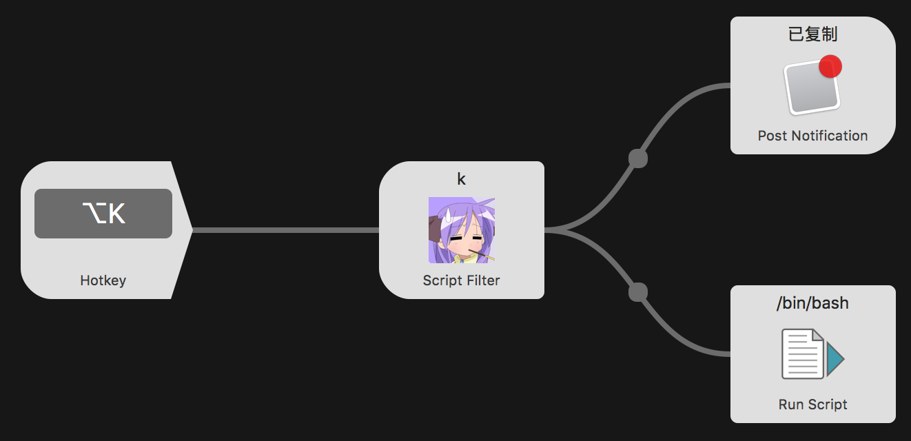

## 表情包搜索 Alfred Workflow

## 项目介绍

本项目为搜索表情包的 Alfred Workflow，主要用于输入关键字，快捷搜索表情包，将搜索到的表情包粘贴到微信、QQ 等聊天工具中，从此斗图战无不胜！

## 安装

1. [下载>>](https://github.com/KURANADO2/emoji-alfredworkflow/releases)
2. 下载 Emoji.alfredworkflow 到本地后，双击即可安装到 Alfred 中

## 使用方法

1. 配置唤醒快捷键，如无快捷键冲突，建议配置为 `Option + K`
2. 使用上一步配置的快捷键唤起工作流脚本，输入关键词搜索表情包
3. 回车键选择表情包，此时表情图片已被自动拷贝到剪贴板
4. 回到微信、QQ 等聊天界面，`Command + V` 粘贴表情包

## 实现原理

1. 调用后台接口，返回图片列表
2. 将图片下载到本地目录，默认为 `/tmp/emoji/` 目录
3. 回车选择图片后，调用脚本，将图片拷贝到剪贴板中
4. 到微信中直接 Command + V 键粘贴

## 为什么有此项目

- 微信表情包收藏只支持收藏 300 张表情包，这对于感情细腻的斗图专业户来说是远远不够的
- 微信表情包收藏查找图片往往需要不停的翻页，才能找到合适的图片

## 工作平台

- 仅支持 Mac

## 关于接口

- 图片来源：[http://emoji.kuranado.com](http://emoji.kuranado.com)

## 参考资料

- [GitHub - alfred-workflow](https://github.com/deanishe/alfred-workflow)
- [Welcome to Alfred-Workflow](https://www.deanishe.net/alfred-workflow/index.html)
- [StackExchange - Copy an image to clipboard from the Mac terminal](https://superuser.com/questions/1132777/copy-an-image-to-clipboard-from-the-mac-terminal)