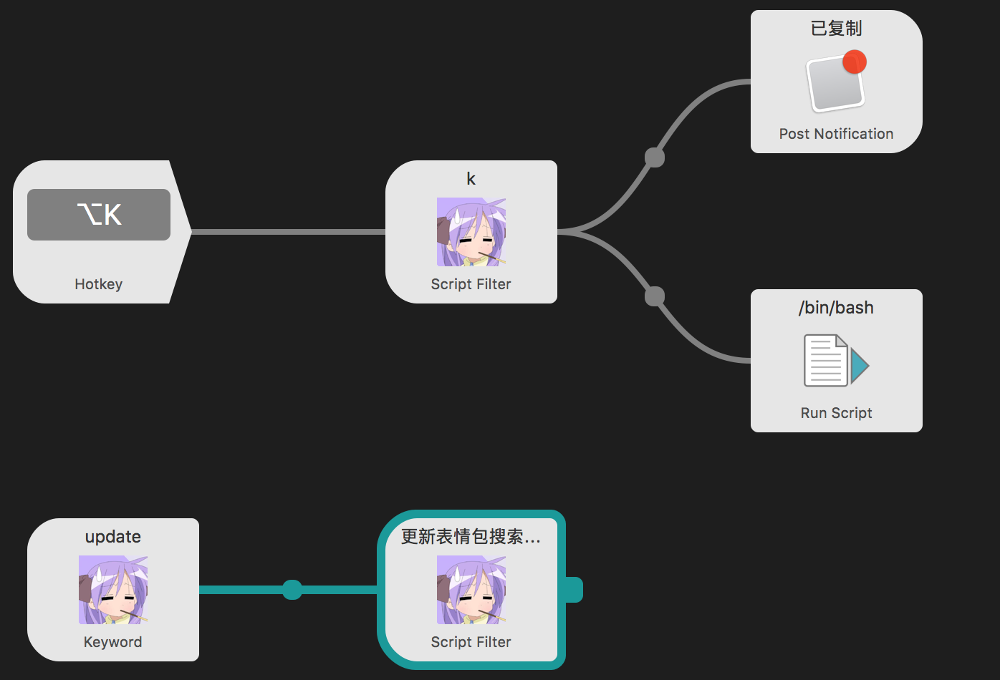
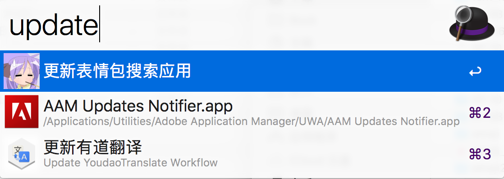
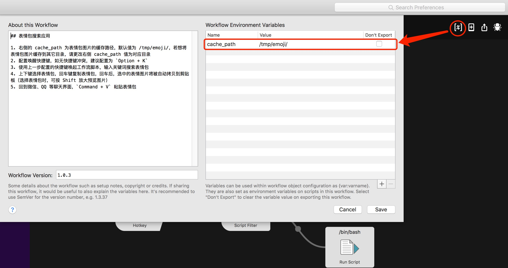

## 表情包搜索 Alfred Workflow

## 项目介绍

本项目为搜索表情包的 Alfred Workflow，主要用于输入关键字，快捷搜索表情包，将搜索到的表情包粘贴到微信、QQ 等聊天工具中，从此斗图战无不胜！

## 安装

1. [下载>>](https://github.com/KURANADO2/emoji-alfredworkflow/releases)
2. 下载 Emoji.alfredworkflow 到本地后，双击即可安装到 Alfred 中

## 使用方法

1. 安装后配置唤醒快捷键，如无快捷键冲突，建议配置为 `Option + K`
2. 使用上一步配置的快捷键唤起工作流脚本，输入关键词搜索表情包
3. 上下键选择表情包，回车键复制表情包，回车后，选中的表情图片将被自动拷贝到剪贴板
4. 回到微信、QQ 等聊天界面，`Command + V` 粘贴表情包

## 搜索小技巧

- 查询语法为：`关键词1[一个空格关键词2][1个空格关键词3]...[1个空格关键词n][1个空格页码]`
如：`come again 3`，则将 `come` 作为`关键词 1`，`again` 作为`关键词 2`，`3` 表示查询第 3 页
- 选择表情包时，可按 Shift 放大预览图片

## 如何更新

- 使用命令触发更新：调起 Alfred 后，输入 `update` 关键字即可检查更新，如果有新版本，将自动下载并安装到 Alfred 中 

- 手动更新：访问 [GitHub Releases 下载页面](https://github.com/KURANADO2/emoji-alfredworkflow/releases)，手动下载当前最新版本，双击将安装更新到 Alfred 中

## 实现原理

1. 调用后台接口，返回图片列表，默认只查询第一页 9 张图片
2. 将图片下载到本地目录，默认为 `/tmp/emoji/` 目录，可通过如下方式更改为其它目录
    
3. 回车选择图片后，调用脚本，将图片拷贝到剪贴板中
4. 到微信中直接 Command + V 键粘贴

## 为什么有此项目

- 微信表情包收藏只支持收藏 300 张表情包，这对于感情细腻的斗图专业户来说是远远不够的
- 微信表情包收藏查找图片往往需要不停的翻页，才能找到合适的图片
- 微信表情包预览图标太小，在将表情包发给聊天对象之前，看不清表情包内容以及文字，影响选择

## 工作平台

- 仅支持 Mac

## 关于接口

所有图片均来源于我的表情包网站：[http://emoji.kuranado.com](http://emoji.kuranado.com)，目前本网站表情包数量有限（6K+），待后续用户投稿功能上线之后，将进一步丰富图片

## 参考资料

- [GitHub - alfred-workflow](https://github.com/deanishe/alfred-workflow)
- [Welcome to Alfred-Workflow](https://www.deanishe.net/alfred-workflow/index.html)
- [StackExchange - Copy an image to clipboard from the Mac terminal](https://superuser.com/questions/1132777/copy-an-image-to-clipboard-from-the-mac-terminal)
- [知乎 - 借助 Alfred 的 Workflows 功能可以做哪些好玩的事情？](https://www.zhihu.com/question/20656680)
- [GitHub - Alfred-Find-Meme](https://github.com/echo-cool/Alfred-Find-Meme)
- [GitHub - Alfred-Find-emoji](https://github.com/echo-cool/Alfred-Find-emoji)
- [CSDN - Python多线程下载网络URL图片的方法](https://blog.csdn.net/guyuealian/article/details/92084641)
- [GitHub - DepQuery - 一个搜索java依赖的Alfred插件](https://github.com/kiwiflydream/DepQuery)